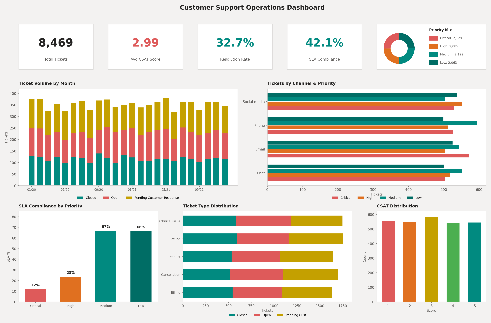
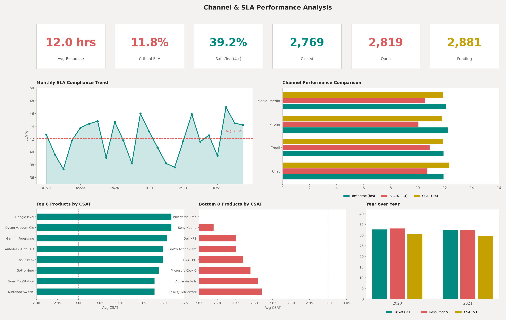

# Customer Support Operations Analysis

## Project Background and Overview

Support operations run on a fundamental conflict: speed costs money, but slow responses cost customers. Finding the right balance requires data. This analysis looks at two years of support tickets from a consumer tech company selling products like GoPro cameras, smart home devices, gaming consoles, laptops.

The dataset covers 8,469 tickets submitted between January 2020 and December 2021 across four channels (email, phone, chat, social media). Each ticket includes priority level, response times, resolution status, and customer satisfaction ratings. The goal here is practical in that it involves figuring out where the operation is working, where it's falling short, and what changes might actually influence customer satisfaction.

A few things stand out immediately. Only about a third of tickets get fully resolved. SLA compliance for critical issues remains around 12%, which is quite low. And customer satisfaction sits at 2.99 out of 5, barely above neutral. These numbers suggest room for improvement, though the underlying causes may be more nuanced than the headline metrics imply.

**Key business questions addressed:**
- Which channels deliver the best combination of speed and satisfaction?
- Where are SLA targets being missed, and by how much?
- What ticket types consume the most resources relative to their outcomes?
- Do response times actually correlate with customer satisfaction in this dataset?

**Dataset Information**

**Source:** [Customer Support Ticket Dataset by suraj520 - Kaggle](https://www.kaggle.com/datasets/suraj520/customer-support-ticket-dataset)

**Provider** suraj520 (Kaggle user)

SQL queries: [Analysis Queries](sql/analysis_queries.sql)

---

## Data Structure Overview

The analysis uses a single denormalized table containing 8,469 records of ticket attributes, timing metrics, and customer information. A reference table holds SLA targets by priority level.

### Entity Relationship Diagram

```
┌─────────────────────────────────────────────────────────────────────────────┐
│                              TICKETS                                        │
├─────────────────────────────────────────────────────────────────────────────┤
│  ticket_id (PK)            INTEGER     Unique ticket identifier             │
│  customer_age              INTEGER     Customer age at ticket creation      │
│  customer_gender           VARCHAR     Male, Female, or Other               │
│  product                   VARCHAR     Product name (42 unique products)    │
│  ticket_date               DATE        Date ticket was created              │
│  ticket_month              VARCHAR     YYYY-MM format for trending          │
│  ticket_year               INTEGER     Year (2020 or 2021)                  │
│  ticket_quarter            INTEGER     Quarter (1-4)                        │
│  day_of_week               VARCHAR     Day name                             │
│  is_weekend                BOOLEAN     Weekend flag                         │
│  ticket_type               VARCHAR     Issue category                       │
│  ticket_subject            VARCHAR     Brief description                    │
│  status                    VARCHAR     Open, Closed, Pending Customer Resp. │
│  priority                  VARCHAR     Critical, High, Medium, Low          │
│  channel                   VARCHAR     Email, Phone, Chat, Social media     │
│  first_response_hours      FLOAT       Hours until first agent response     │
│  resolution_hours          FLOAT       Hours from response to resolution    │
│  sla_target_hours          INTEGER     Target response time (from SLA table)│
│  sla_met                   BOOLEAN     Response within SLA target           │
│  csat_score                INTEGER     Customer satisfaction (1-5 scale)    │
└─────────────────────────────────────────────────────────────────────────────┘
         │
         │ N:1 (priority)
         ▼
┌─────────────────────────────────────────────────────────────────────────────┐
│                            SLA_TARGETS                                      │
├─────────────────────────────────────────────────────────────────────────────┤
│  priority (PK)             VARCHAR     Priority level                       │
│  response_target_hours     INTEGER     First response SLA (hours)           │
│  resolution_target_hours   INTEGER     Full resolution SLA (hours)          │
└─────────────────────────────────────────────────────────────────────────────┘
```

### SLA Targets Reference

| Priority | Response Target | Resolution Target |
|----------|-----------------|-------------------|
| Critical | 4 hours | 24 hours |
| High | 8 hours | 48 hours |
| Medium | 24 hours | 72 hours |
| Low | 48 hours | 120 hours |

### Data Dictionary

| Field | Description | Values |
|-------|-------------|--------|
| **ticket_type** | Primary issue classification | Refund request, Technical issue, Cancellation request, Product inquiry, Billing inquiry |
| **channel** | Customer contact method | Email, Phone, Chat, Social media |
| **priority** | Urgency based on impact | Critical, High, Medium, Low |
| **status** | Current ticket state | Open (awaiting response), Pending Customer Response, Closed |
| **csat_score** | Post-resolution satisfaction | 1 (very dissatisfied) to 5 (very satisfied) |
| **first_response_hours** | Time from ticket creation to first agent reply | Continuous; only populated for non-Open tickets |
| **sla_met** | Whether response met the priority's SLA target | Boolean |

---

## Executive Summary

Across 8,469 tickets over two years, the support operation shows stable volume but mixed performance on core metrics. The resolution rate sits at just 33%, meaning two-thirds of tickets remain open or awaiting customer response at any given time. Average customer satisfaction among resolved tickets is 2.99 out of 5, essentially neutral.

### Key Performance Metrics

| Metric | Value | Assessment |
|--------|-------|------------|
| Total Tickets | 8,469 | Roughly 350/month average |
| Resolution Rate | 32.7% | Low; large backlog |
| Avg First Response | 12.0 hours | Misses Critical/High SLAs |
| Overall SLA Compliance | 42.1% | Below target |
| Avg CSAT (Closed) | 2.99 | Neutral |
| Satisfied Customers (4+) | 39.2% | Under 40% |

### Dashboard



Volume stays relatively flat across the two-year period, averaging 350 tickets monthly with no strong seasonality. The four channels split volume almost equally, which is somewhat unusual; most operations see one or two dominant channels. Ticket types also distribute evenly, with refund requests slightly leading at 21% of volume.

The SLA picture is more concerning. Critical tickets, those requiring response within 4 hours, achieve only 12% compliance. High-priority tickets fare better at 23%, but both fall well short of reasonable targets. Medium and Low priorities meet their (more generous) targets about two-thirds of the time. The root issue appears to be a 12-hour average response time that simply cannot meet the tighter SLAs regardless of priority.

Customer satisfaction correlates weakly with channel choice. Chat edges out other channels at 3.08 average CSAT and 41.5% satisfaction rate, while Phone trails at 2.95 and 38.5%. The gaps are modest though, which suggest channel is not the primary driver of customer experience.

---

## Insights Deep Dive

### 1. Critical and High Priority SLA Compliance Falls Far Below Target

The most significant finding involves high-urgency tickets. Critical issues require a 4-hour response; the actual average is 12.1 hours, three times the target. Only 12% of Critical tickets meet their SLA. High-priority tickets need response within 8 hours but average 11.9 hours, achieving 23% compliance.

| Priority | SLA Target | Avg Response | SLA Compliance | Gap |
|----------|------------|--------------|----------------|-----|
| Critical | 4 hours | 12.1 hours | 11.8% | 3x over |
| High | 8 hours | 11.9 hours | 23.4% | 1.5x over |
| Medium | 24 hours | 11.9 hours | 66.8% | Within |
| Low | 48 hours | 12.2 hours | 66.3% | Within |

What makes this puzzling is that response times barely differ by priority. Critical tickets are answered in 12.1 hours on average; Low-priority tickets take 12.2 hours. The system appears to treat all tickets roughly equally regardless of urgency tagging. Either the priority field isn't surfaced effectively to agents, or staffing levels make it impossible to provide faster response to any ticket.

The business impact is significant. Critical tickets typically involve service outages, payment failures, or other issues where delay compounds customer frustration. Missing 88% of these SLAs likely contributes to the mediocre satisfaction scores. Even a modest improvement, getting Critical compliance from 12% to 50%, would require cutting average response time to under 4 hours for these tickets specifically.



### 2. All Channels Perform Similarly Despite Different Cost Structures

A typical assumption would be that real-time channels like Phone and Chat outperform asynchronous channels like Email on speed and satisfaction. This dataset challenges that assumption. All four channels show nearly identical response times (11.9-12.2 hours) and SLA compliance rates (40-44%).

| Channel | Volume | Avg Response | SLA % | CSAT | Satisfied % |
|---------|--------|--------------|-------|------|-------------|
| Email | 2,143 (25%) | 11.9 hrs | 43.5% | 2.96 | 39.6% |
| Phone | 2,132 (25%) | 12.2 hrs | 40.2% | 2.95 | 38.5% |
| Social Media | 2,121 (25%) | 12.1 hrs | 42.1% | 2.97 | 37.4% |
| Chat | 2,073 (24%) | 11.9 hrs | 42.8% | 3.08 | 41.5% |

Chat does show a slight edge on CSAT (3.08 vs 2.95-2.97 for others) and satisfaction rate (41.5% vs 37-40%). The difference is small but consistent. Phone, often assumed to deliver better service through human connection, actually trails slightly on satisfaction metrics.

The even volume split across channels is something to note. Many support operations see 60-70% of volume through one primary channel. Here, customers seem equally comfortable using any contact method, which could indicate good channel availability or could suggest customers are channel-shopping when their preferred method doesn't resolve their issue quickly.

From a cost perspective, Phone typically costs 3-4x more per contact than Chat or Email. If Phone isn't delivering better outcomes, there may be an opportunity to shift volume toward more cost-effective channels without hurting satisfaction.

### 3. Two-Thirds of Tickets Remain Unresolved

Only 2,769 tickets (33%) reached Closed status. The remaining 67% split between Open (33%) and Pending Customer Response (34%). This backlog creates several problems: it inflates response times for new tickets, it leaves customers in limbo, and it makes performance metrics harder to interpret.

| Status | Tickets | Percent |
|--------|---------|---------|
| Pending Customer Response | 2,881 | 34.0% |
| Open | 2,819 | 33.3% |
| Closed | 2,769 | 32.7% |

The "Pending Customer Response" category deserves scrutiny. These tickets are waiting for the customer to reply with additional information. At 34% of all tickets, this seems high. Possible explanations include: agents asking overly broad questions that customers don't know how to answer, customers abandoning tickets because they resolved the issue themselves, or customers giving up due to slow initial response.

Open tickets, those awaiting agent response, represent another third of volume. These are the active backlog. With 2,819 tickets waiting and roughly 350 new tickets arriving monthly, the queue never clears. This perpetual backlog likely explains why response times don't vary by priority; agents may be working through tickets in order received rather than by urgency.

A 33% resolution rate is quite low for tech support. Industry benchmarks typically fall in the 70-85% range. The gap suggests either a measurement issue (tickets not being closed properly) or a genuine operational problem worth investigating.

### 4. Customer Satisfaction Barely Reaches Neutral

Among resolved tickets, average CSAT is 2.99 on a 5-point scale. The distribution is nearly uniform across all five ratings, with each score receiving 19-21% of responses. Only 39% of customers rate their experience 4 or 5 (satisfied).

| CSAT Score | Tickets | Percent |
|------------|---------|---------|
| 1 (Very Dissatisfied) | 553 | 20.0% |
| 2 (Dissatisfied) | 549 | 19.8% |
| 3 (Neutral) | 580 | 20.9% |
| 4 (Satisfied) | 543 | 19.6% |
| 5 (Very Satisfied) | 544 | 19.6% |

The uniform distribution is unusual. Most support operations see a J-curve with peaks at 1 and 5, reflecting the tendency of people with strong opinions to respond. This flat distribution could indicate survey fatigue, random clicking, or genuinely mixed experiences.

Breaking down by ticket type reveals modest variation. Cancellation requests and billing inquiries score slightly higher (3.03) while refund requests score lower (2.93). The spread is narrow though. No ticket type achieves average satisfaction above 3.1 or below 2.9.

| Ticket Type | Volume | CSAT | Satisfied % |
|-------------|--------|------|-------------|
| Cancellation Request | 1,695 | 3.03 | 40.8% |
| Billing Inquiry | 1,634 | 3.03 | 39.9% |
| Product Inquiry | 1,641 | 3.02 | 40.2% |
| Technical Issue | 1,747 | 2.96 | 38.1% |
| Refund Request | 1,752 | 2.93 | 37.8% |

### 5. Year-Over-Year Performance Declined Slightly

Comparing 2020 to 2021 shows a small decline across most metrics. CSAT dropped from 3.04 to 2.94, and resolution rate fell from 33.1% to 32.3%. Volume remained essentially flat. SLA compliance stayed stable at 42%.

| Year | Tickets | Resolution Rate | CSAT |
|------|---------|-----------------|------|
| 2020 | 4,236 | 33.1% | 3.04 |
| 2021 | 4,233 | 32.3% | 2.94 |

The CSAT decline of 0.10 points may seem small, but on a 5-point scale it represents meaningful erosion. Moving from 3.04 to 2.94 means crossing below the neutral midpoint. If this trend continued, satisfaction would slip into clearly negative territory.

Possible factors include pandemic-related stress on both customers and agents during 2020-2021, supply chain issues affecting product availability and returns, or gradual degradation in service quality as the backlog grew. Without additional context, it's difficult to pinpoint the cause.

### 6. Product Mix Shows Some Outliers Worth Investigating

Among 42 products, support volume ranges from 178 to 240 tickets per product over two years. Most products cluster between 190-220 tickets, suggesting relatively even distribution. A few outliers stand out on CSAT.

**Lowest CSAT Products:**

| Product | Tickets | CSAT | Satisfied % |
|---------|---------|------|-------------|
| Sony Xperia | 217 | 2.69 | 33.3% |
| LG OLED | 213 | 2.77 | 35.7% |
| Apple AirPods | 213 | 2.81 | 36.8% |

**Highest CSAT Products:**

| Product | Tickets | CSAT | Satisfied % |
|---------|---------|------|-------------|
| GoPro Hero | 228 | 3.19 | 46.5% |
| Nest Thermostat | 225 | 3.08 | 42.9% |
| Amazon Echo | 221 | 3.04 | 40.5% |

Sony Xperia generates the lowest satisfaction at 2.69, a full 0.50 points below GoPro Hero at 3.19. This gap is large enough to warrant investigation. Possible explanations include product quality issues, inadequate agent training on that product, or a customer base with higher expectations.

The pattern may also reflect ticket type mix by product. If Sony Xperia tickets skew toward refund requests (the lowest-scoring type) while GoPro tickets skew toward product inquiries (higher-scoring), the product itself may not be the issue.

---

## Recommendations

### 1. Implement Priority-Based Routing and Escalation

The current system treats all tickets equally regardless of priority, resulting in 12% SLA compliance for Critical issues. This needs to change.

A straightforward fix: route Critical and High tickets to a dedicated queue with its own staffing. Even assigning 2-3 agents exclusively to urgent tickets during peak hours could improve compliance dramatically. Set alerts when Critical tickets approach their 4-hour SLA; at 3 hours without response, escalate automatically to a supervisor.

The goal isn't perfection. Moving Critical SLA from 12% to 50% would represent major progress and likely boost satisfaction among the customers with the most urgent problems.

### 2. Investigate and Clear the Ticket Backlog

With 67% of tickets unresolved, the backlog is the elephant in the room. Start by auditing the "Pending Customer Response" category. If customers aren't replying after 7-10 days, consider auto-closing with a satisfaction survey. This alone could close nearly 3,000 tickets and provide data on why customers abandon tickets.

For Open tickets, calculate how many agent-hours it would take to clear the queue versus daily incoming volume. If the team is permanently piled over with tickets, the calculations will show it. That makes the case for additional headcount or process changes to reduce handle time.

### 3. Shift Volume Toward Chat

Chat achieves the highest satisfaction (3.08) at typically lower cost than Phone. Consider promoting Chat more prominently on the website and in-app, testing proactive chat offers during high-friction moments like checkout, and routing simpler ticket types (product inquiries, billing questions) to Chat by default.

The expected outcome isn't transformation; Chat's lead over other channels is modest. But even small gains in satisfaction combined with lower cost per contact improve the overall economics of support.

### 4. Deep-Dive on Low-CSAT Products

Sony Xperia, LG OLED, and Apple AirPods score 0.3-0.5 points below average on satisfaction. Pull a sample of these tickets to understand why. Are agents missing key troubleshooting steps? Are these products genuinely more problematic? Is the customer demographic different?

If the issue is product-specific, targeted agent training or updated knowledge base articles might help. If the issue is customer expectations (premium products attracting pickier buyers), the solution might involve setting better expectations upfront or offering faster resolution paths for high-value items.

### 5. Revisit SLA Targets for Realism

Current targets may be aspirational rather than achievable. A 4-hour response SLA for Critical tickets is aggressive; many support operations set 8-12 hours as their Critical target. If the organization lacks the capacity to meet 4-hour SLAs, two options exist: invest to build that capacity, or adjust targets to something achievable.

Running an operation that misses 88% of its Critical SLAs creates a culture of failure. Agents know the targets are unrealistic, so they stop trying to meet them. Setting achievable targets (even if less ambitious) and then consistently hitting them may produce better behavior and outcomes than setting extreme targets and consistently missing.

---

## Limitations and Future Work


**Time fields:** The original First Response Time and Time to Resolution fields contained timestamp data that didn't align chronologically with ticket creation dates. Response hours were derived from the time component of these fields, which may not perfectly represent actual response durations.

**Resolution data:** Only 33% of tickets show as Closed, with CSAT scores only available for closed tickets. This limits satisfaction analysis to a subset of the data and may introduce selection bias if tickets that close successfully differ systematically from those that don't.

**Single point in time:** The data represents a snapshot. We can see correlations (faster response associates with higher satisfaction) but cannot establish causation without experimental data or longitudinal tracking of policy changes.

**No cost data:** The analysis discusses channel cost-effectiveness but lacks actual cost figures. Phone being more expensive than Chat is a general industry pattern, not a finding from this specific dataset.

---

## Technical Implementation

### SQL Queries

Analysis conducted using SQLite. Key query patterns:

| Pattern | Purpose | Example |
|---------|---------|---------|
| Aggregation | Volume and rate calculations | `COUNT(*)`, `AVG(first_response_hours)` |
| Conditional | SLA compliance, satisfaction rates | `SUM(CASE WHEN sla_met = 1 THEN 1 ELSE 0 END)` |
| Grouping | Segment by channel, priority, time | `GROUP BY channel, priority` |
| Joins | Link tickets to SLA targets | `LEFT JOIN sla_targets ON priority` |
| Date functions | Monthly and quarterly trends | `GROUP BY ticket_month` |

### Repository Structure

```
├── README.md
├── 01_executive_dashboard.png
├── 02_channel_sla_analysis.png
├── data/
│   └── customer_support_tickets.csv
└── sql/
    └── analysis_queries.sql
```

### Data Source

This analysis uses [Kaggle's Customer Support Ticket Dataset](https://www.kaggle.com/datasets/suraj520/customer-support-ticket-dataset). The dataset represents a consumer tech company's support operations but has been anonymized and may have synthetic elements.
